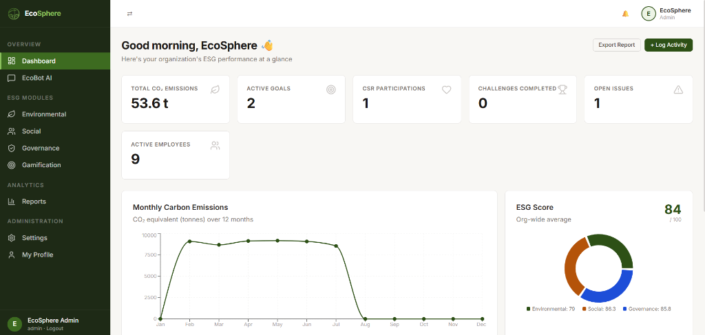
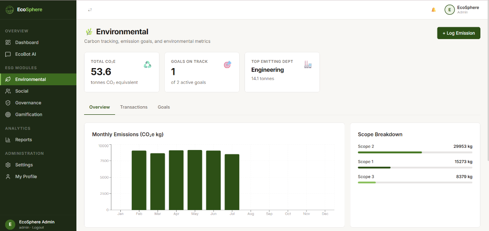
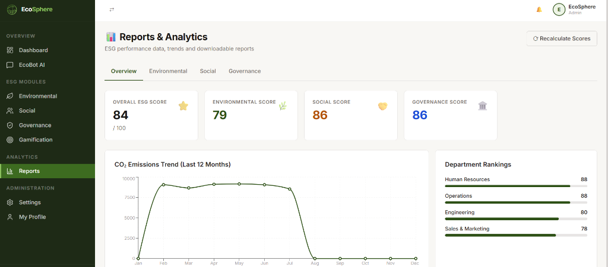
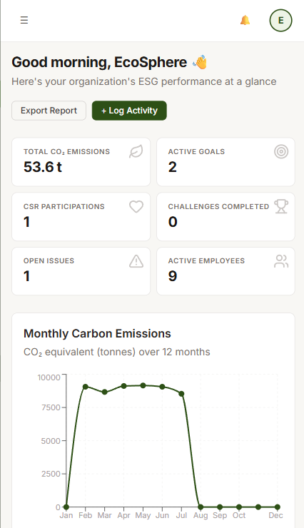
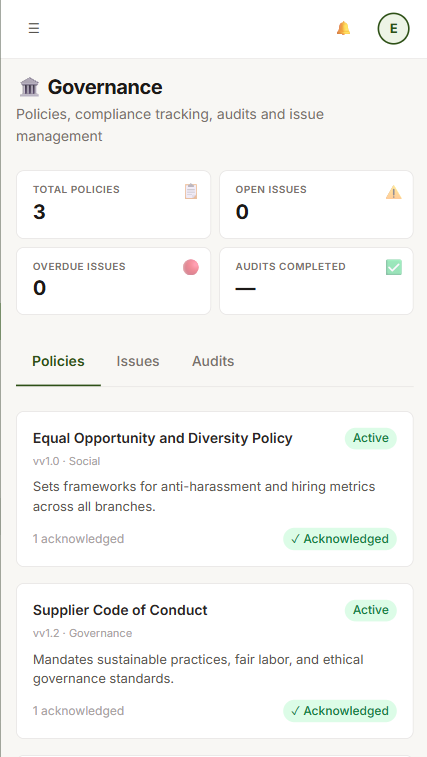
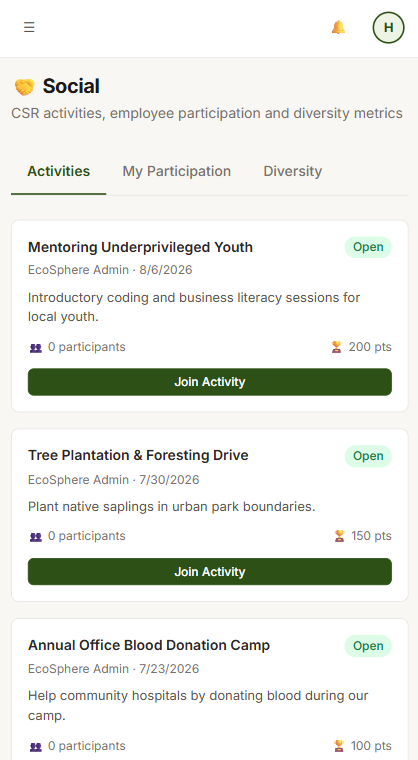

<div align="center">

```
███████╗ ██████╗ ██████╗ ███████╗██████╗ ██╗  ██╗███████╗██████╗ ███████╗
██╔════╝██╔════╝██╔═══██╗██╔════╝██╔══██╗██║  ██║██╔════╝██╔══██╗██╔════╝
█████╗  ██║     ██║   ██║███████╗██████╔╝███████║█████╗  ██████╔╝█████╗  
██╔══╝  ██║     ██║   ██║╚════██║██╔═══╝ ██╔══██║██╔══╝  ██╔══██╗██╔══╝  
███████╗╚██████╗╚██████╔╝███████║██║     ██║  ██║███████╗██║  ██║███████╗
╚══════╝ ╚═════╝ ╚═════╝ ╚══════╝╚═╝     ╚═╝  ╚═╝╚══════╝╚═╝  ╚═╝╚══════╝
```

### 🌍 the planet filed a support ticket. we shipped the fix.

**an ESG platform that turns "we care about sustainability" from a LinkedIn caption into an actual audit trail**

[](https://odoo-ecosphere.onrender.com/)
[](https://github.com/Notanormaldev/Odoo_EcoSphere)
[](#-team-clickjack)

</div>

<br>

> ### *"Built by Team Clickjack — for the ones who ship, not just talk."*

<br>

---

## 🫡 what even is this

Most companies have an ESG policy. It lives in a PDF. In some forgotten Google Drive folder. Nobody reads it.

**EcoSphere** turns that PDF into a living, breathing dashboard — where carbon emissions get logged, CSR activities get tracked, audits sit in a queue waiting to be closed, and employees get genuinely competitive over badges (yes, sustainability runs on gamification now, fight us).

Environmental + Social + Governance — all three pillars, one login.

<br>

## ⚡ live in 10 seconds

| | |
|---|---|
| 🔗 **Live App** | [odoo-ecosphere.onrender.com](https://odoo-ecosphere.onrender.com/) |
| 📂 **Repo** | [github.com/Notanormaldev/Odoo_EcoSphere](https://github.com/Notanormaldev/Odoo_EcoSphere) |
| 👑 **Admin login** | `admin@ecosphere.com` / `password123` |
| 👨‍💻 **Employee login** | `harsh@ecosphere.com` / `password123` |

*(hosted on a spin-down server, so the first request might wake up a little groggy — patience, it's warming up like a Monday morning ☕)*

<br>

---

## 📸 platform interface showcase

### 🖥️ Desktop Interface

| Dashboard | Environmental Module |
|---|---|
|  |  |

| Reports & Analytics |
|---|
|  |

### 📱 Mobile Responsiveness

| Mobile Dashboard | Mobile Governance | Mobile Social |
|---|---|---|
|  |  |  |

<br>

---

## 🧩 what's actually inside

```
┌──────────────────────────────────────────────────────────────────┐
│                        E C O S P H E R E                          │
│                                                                    │
│   🌿 ENVIRONMENTAL          🤝 SOCIAL             🏛️ GOVERNANCE   │
│   ─────────────────         ──────────────         ───────────── │
│   Scope 1/2/3 logging       CSR event workflows     Policy pub +  │
│   Emission factor engine    Volunteer verification  acknowledge   │
│   Goal tracking             Diversity analytics     Audit trails  │
│   On-Track / At-Risk tags   Manager approvals       Issue severity│
│                                                                    │
│              🏆 GAMIFICATION        💬 ECOBOT AI                  │
│              ─────────────         ──────────────                 │
│              XP + Points           Gemini 2.0 Flash               │
│              Auto-unlock badges    LangChain powered              │
│              Live leaderboards     <200ms local fallback          │
└──────────────────────────────────────────────────────────────────┘
```

- **Carbon accounting that doesn't require a spreadsheet PhD** — log Scope 1 (direct), Scope 2 (electricity), Scope 3 (value chain), auto-computed into CO₂e.
- **CSR that isn't just a poster in the break room** — beach cleanups, blood drives, real sign-ups, real manager verification.
- **Governance that has receipts** — every policy acknowledgement and audit action is logged in a non-repudiation trail. No "I never saw that email" excuses.
- **Gamification because humans respond to dopamine, not spreadsheets** — badges like *Carbon Champion* and *CSR Hero* unlock automatically.
- **EcoBot, the assistant that refuses to go down** — ask it about GRI, SASB, TCFD, or UN SDGs. Gemini answers live; if Gemini gets rate-limited (free-tier problems, we've all been there), a local knowledge base catches the fall in under 200ms. Zero "connection error" screens, zero drama.

<br>

## 🛠️ the stack (no glassmorphism, no gradient soup, just engineering)

<div align="center">

| Layer | Tech |
|---|---|
| **Frontend** | React 18 · Vite · Zustand · TanStack Query · Recharts · Vanilla CSS design tokens |
| **Backend** | Node.js · Express.js · Mongoose (MongoDB Atlas) · Redis · Passport.js |
| **AI Layer** | LangChain JS + Google Generative AI (`gemini-2.0-flash`) |
| **Mail** | Nodemailer / Brevo SMTP |
| **Auth** | JWT (15-min access / 7-day refresh) · bcrypt (12 rounds) · Redis blacklist on logout |
| **Testing** | Jest |

</div>

### 🔐 security architecture (actually enforced, not just vibes)

#### 🛡️ Helmet — HTTP Security Headers

Every response carries hardened headers set by [Helmet](https://helmetjs.github.io/):

| Header | Value | Protects Against |
|---|---|---|
| `Content-Security-Policy` | `default-src 'self'`, no inline scripts | XSS, script injection |
| `X-Content-Type-Options` | `nosniff` | MIME-type sniffing |
| `X-Frame-Options` | `DENY` | Clickjacking |
| `X-XSS-Protection` | `1; mode=block` | Reflected XSS (legacy browsers) |
| `Strict-Transport-Security` | `max-age=31536000; includeSubDomains; preload` | SSL stripping (production only) |
| `Cross-Origin-Resource-Policy` | `cross-origin` | Cross-origin data leaks |

#### 🧹 XSS Input Sanitiser

A custom middleware (`xssSanitiser`) strips dangerous patterns from **every** incoming `req.body`, `req.query`, and `req.params` before it touches any controller:

- `<script>…</script>` blocks removed
- `javascript:` protocol URIs stripped
- Inline event handlers (`onclick=`, `onload=`, etc.) stripped
- `<iframe>` tags removed
- HTML comment injections (`<!-- -->`) removed

#### ⏱️ Rate Limiting — Per-Route Caps

| Route | Limit | Window | Blocks |
|---|---|---|---|
| All `/api/*` routes | 500 req | 15 min | General abuse / DDoS |
| `/api/auth/login` | 10 req | 15 min | Credential stuffing / brute force |
| `/api/auth/register` | 10 req | 15 min | Registration spam |
| `/api/chatbot/chat` | 30 req | 15 min | Gemini API quota abuse |
| `/api/reports` | 10 req | 60 min | Bulk CSV scraping |

All limiters return RFC 6585 `RateLimit-*` response headers. When a cap is hit, the API returns `429 Too Many Requests` with a `retryAfter` field — no cryptic error pages.

#### 🔑 Authentication

- **Dual-token JWT** — short-lived (15 min) access tokens + long-lived (7 day) refresh tokens in HttpOnly cookies
- **Redis token blacklist** — logout is instant everywhere; intercepted tokens are dead on arrival
- **bcrypt @ 12 rounds** — no plaintext passwords, ever
- **Google OAuth 2.0** — corporate SSO without password exposure

#### 📦 Payload Hardening

- JSON body limit set to **2 MB** — blocks payload bloat / memory exhaustion attacks
- `express.urlencoded` limit also set to **2 MB**

<br>

## 🏗️ how the pieces talk

```
      React / Vite Client
   (Charts · Zustand · Forms · EcoBot UI)
                 │  HTTP JSON
                 ▼
      Express API Gateway
   (Helmet CSP · XSS Sanitiser · Rate Limiter · Passport Auth)
        │         │           │
        ▼         ▼           ▼
    MongoDB     Redis      Gemini API
   (ESG data)  (Blacklist   (LangChain
              + Rate Caps)   + Fallback DB)
```

Client-side rendering keeps the server lean. Redis keeps auth fast. The AI layer never leaves the user hanging — even when Google's servers are having a bad day.

<br>

## 🚀 run it yourself

```bash
# clone the crime scene
git clone https://github.com/Notanormaldev/Odoo_EcoSphere.git
cd Odoo_EcoSphere

# environment setup
cp backend/.env.example backend/.env
# fill in: MONGO_URI, JWT_SECRET, GOOGLE_GEMINI_API, REDIS_HOST, REDIS_PORT

# install everything, both sides
npm run install-all

# fire it up (frontend + backend together)
node dev.js
```

Open `http://localhost:5173` and pretend you're the Chief ESG Strategist.

<br>

## 📱 it doesn't break on your phone either

Desktop gets the full sidebar + grid experience. Tablet collapses gracefully. Mobile gets a slide-in drawer, horizontally-scrolling tabs, and a 2-column KPI grid — because nobody should have to pinch-zoom to check their carbon footprint.

<br>

---

## 👾 Team Clickjack

We don't do vaporware. We don't do "coming soon." We ship, we deploy to Render, and we write READMEs with ASCII banners at 2 AM.

<div align="center">

### *Built by Team Clickjack — for the ones who ship, not just talk.*

**[🌐 Live Demo](https://odoo-ecosphere.onrender.com/) · [💻 Source Code](https://github.com/Notanormaldev/Odoo_EcoSphere)**

</div>
